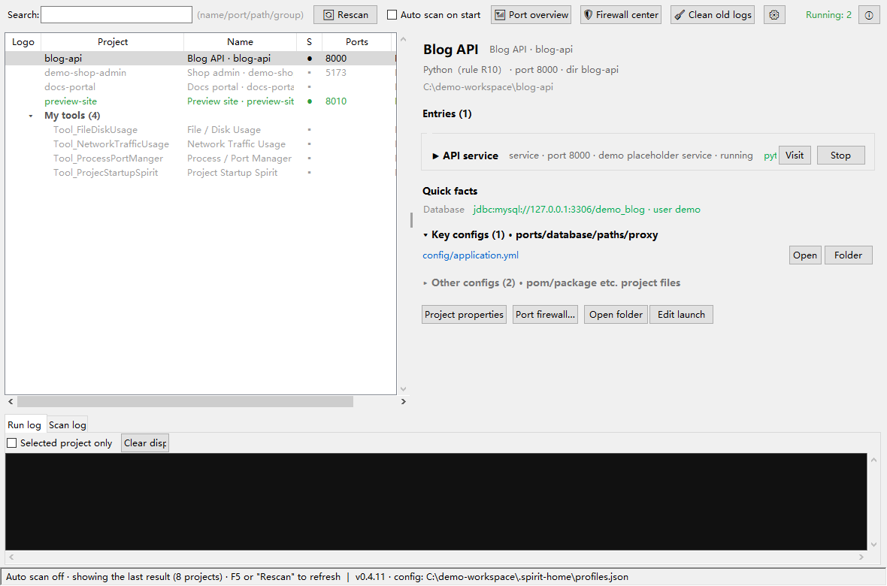

# Project Startup Spirit (项目启动精灵)

[简体中文](README.md) | English

> A small desktop tool that "scans your workspace and one-click-starts any project's dev environment": it auto-detects how each project starts (bat / npm / mvn / node / static page / bundled runtime…), then starts services, opens the browser and manages ports on a double-click. No install needed — copy it and it runs.



## Current status

| Item | Value |
|---|---|
| Version | **v0.4.22 implemented** (2026-10-03, Python 3.8+ / tkinter / psutil) |
| Code | main.py + core/ (13 modules) + app/ (3 modules) + tools/selftest.py |
| Detection regression | **selftest 34/34 passed (appendix A match rate 100%, threshold 90%) + v0.2 metadata invariant + v0.2.4 log invariant + v0.4.2 nginx invariants & real-config calibration + v0.4.3 R12 invariant + v0.4.4 grouping/identity-key invariants (incl. v0.4.5 site group names) + v0.4.6 firewall invariants (pure functions) + v0.4.7 port invariants (under_dir path test / listen_map live-socket snapshot / manual_split multi-path) + v0.4.8 nginx reference-row invariants (group_refs merge/dedupe/grouping; v0.4.13 adds per-ref conf) + v0.4.9 nginx exclusion invariants (filter_excluded normcase exact match/order/edges) + v0.4.10 UI language invariants (all tr literals covered / placeholders consistent across languages / mapping values present / missing-key fallback) + v0.4.12 launcher invariants (preflight friendly block / local-script skip / node fallback resolution / no caching of misses) + v0.4.14 type-mix invariants (stack order / same-type merge / non-stack excluded / recompute guard) + v0.4.15 Docker invariants (ps/port/mount parsing, four mount normal forms / D1–D3 linking pure functions + live-machine calibration) + v0.4.16 reference-row possibly-linked filter invariants (default unchanged / filter leaves truly hosted only / emptied conf drops the whole group / mixed rows kept) + v0.4.17 status-poll invariants (normalize_poll_seconds valid pass-through / junk fallback / both-end clamp / defaults) + v0.4.18 firewall invariants (desc excludes netsh-rejected chars / separator round-trip / Profile=0 → all) + v0.4.20 LAN-access invariants (npm run/vite recognition & word boundary / --host inject dedupe / package.json dual condition + cwd fallback / switch gate) + v0.4.21 portable-env invariants (portable_dirs text parsing / three-layout expansion / extra_dirs before PATH, cache bypassed / JAVA_HOME detection / child-process PATH prepend / preflight same caliber) + v0.4.22 portable-env deep-expansion invariants (whole bundle root down to three levels / bin & dot-dirs not descended / deep JDK detection) pass** |
| v0.4.22 new | **Portable-env expansion deepened to match Tool_PortableEnvironment** (docs/07 v0.4.22, docs/08 §13): once the first Tool_PortableEnvironment build landed, a side-by-side check showed env.bat wildcards `runtime\java\<any-name>\bin` (any JDK zip drops in without renaming) while the Spirit's v0.4.21 expansion only reached first-level subfolders — configuring `...\runtime` hit Node/Python, the whole bundle root hit nothing, and the JDK slot was unreachable. `portable_search_dirs` now expands to **third-level subfolders + each level's `bin`** (bin and dot-dirs are not descended into) and `java_home_from` reuses the same expansion: filling the **whole bundle root** alone hits everything (`runtime\node` at level two, `runtime\java\<name>\bin` at level three), aligned with env.bat; verified against the real environment package (node/npm/python all resolve to the portable copies). The adaptation lives only in the Spirit (the consumer tolerates producer layouts); env.bat/README untouched |
| v0.4.21 new | **Portable environment paths** (docs/04 settings table, docs/08 §13, docs/07 v0.4.21): the Spirit copies over and runs, but the projects' tools (Node/JDK/Maven…) don't travel with it — on a machine without them nothing starts (the config surface reserved for the Tool_PortableEnvironment package). New Settings section "Portable environments" (after LAN access): `settings.portable_env`, a multi-line directory list (one per line + "Add folder…", default empty with zero migration, no existence check). At preflight/launch these directories resolve dependencies **before the system PATH**: `portable_dirs` (quote/whitespace tolerant, `%VAR%`/`~` expansion, **relative paths anchor to the Spirit's own folder** — copy the Spirit together with `portable\node` and the config needs no edit) → `portable_search_dirs` (root + first-level subfolders + their `bin`; portable node dirs, bundle roots and JDK roots all hit) → `which_first(cmd, extra_dirs)` portable → PATH → node fallback (extra_dirs bypass the cache); `preflight`/`launch` share the same caliber, so a portable-resolvable launch is never blocked by the preflight; at spawn the child **PATH is prepended** with the portable dirs + a detected JDK sets `JAVA_HOME` — the whole launch chain (npm run's node/vite, bare `java` calls) sees it. selftest adds `check_portable`; sandbox end-to-end smoke: inside the child, `where node.exe` hits the portable node **first** (ahead of the machine's real node) and `JAVA_HOME` points at the portable JDK |
| v0.4.21 new | **Portable environment paths** (docs/04 settings table, docs/08 §13, docs/07 v0.4.21): the Spirit copies over and runs, but the projects' tools (Node/JDK/Maven…) don't travel with it — on a machine without them nothing starts (the config surface reserved for the Tool_PortableEnvironment package). New Settings section "Portable environments" (after LAN access): `settings.portable_env`, a multi-line directory list (one per line + "Add folder…", default empty with zero migration, no existence check). At preflight/launch these directories resolve dependencies **before the system PATH**: `portable_dirs` (quote/whitespace tolerant, `%VAR%`/`~` expansion, **relative paths anchor to the Spirit's own folder** — copy the Spirit together with `portable\node` and the config needs no edit) → `portable_search_dirs` (root + first-level subfolders + their `bin`; portable node dirs, bundle roots and JDK roots all hit) → `which_first(cmd, extra_dirs)` portable → PATH → node fallback (extra_dirs bypass the cache); `preflight`/`launch` share the same caliber, so a portable-resolvable launch is never blocked by the preflight; at spawn the child **PATH is prepended** with the portable dirs + a detected JDK sets `JAVA_HOME` — the whole launch chain (npm run's node/vite, bare `java` calls) sees it. selftest adds `check_portable`; sandbox end-to-end smoke: inside the child, `where node.exe` hits the portable node **first** (ahead of the machine's real node) and `JAVA_HOME` points at the portable JDK |
| v0.4.20 new | **LAN access: a general --host switch + firewall prompt** (docs/04 settings table, docs/08 §9, docs/07 v0.4.20): LAN access = --host listening + firewall allow (+ port not drifted); the Spirit only handled the firewall part — Vite dev servers listen on localhost only, so G_EmpiresLike was unreachable at `192.168.232.129:5173`, and G_DungeonLike drifted to 5200/5233 with 5173 taken. ① New Settings section "LAN access": "auto listen on all NICs when starting Vite dev (inject --host)" toggle (default off, `settings.lan_auto_host`, zero migration) — when launching `npm run <script>` whose package.json has vite as a dependency **and** the script starts with vite, `-- --host` is appended automatically (deduped; injection happens before `_resolve_exe`; nodemon etc. untouched); ② after firewall rules are written, if the project has a "Vite dev without --host" entry and the switch is off, a dialog offers to enable it (next start; running services need a restart); ③ selftest adds `check_lan_host`. Boundaries: global granularity; Vite still drifts when the port is taken — open the firewall for the actual port |
| v0.4.19 new | **Selectable name/path in details & properties** (docs/04, docs/07 v0.4.19): the detail header (display name, subtitle with the folder name, full path) and the properties dialog's "Directory" line were plain `tk.Label`s — text could not be selected or copied. They now use the new `app/widgets.selectable_entry`: a flat readonly `tk.Entry` that looks like a Label but supports drag-select, double-click word, triple-click/Ctrl+A select-all and Ctrl+C. **Interaction change**: the path line now opens the folder on **double-click** (single click is reserved for text selection); a tooltip explains |
| v0.4.17 new | **Configurable status polling** (docs/04 §2/§4.3, docs/07 v0.4.17): the main-window status-dot poll used to hard-code a 2-second reschedule; it is now a Settings section "Status refresh" (after the Docker block) with an auto-refresh toggle (default on) and an interval Spinbox 1–60 s (default 2). `settings.status_poll_enabled` / `status_poll_seconds` with zero migration; `profiles.normalize_poll_seconds` clamps junk input; saving applies immediately via the `on_poll_changed` callback — no restart needed. Off = no periodic polling (the one-shot snapshot at startup/rescan is kept); the Port overview dialog keeps its own independent auto-refresh. selftest adds `check_poll_settings` |
| v0.4.14 new | **Combined type on the detail page**: mixed frontend+backend projects now list every stack type in the detail subtitle (e.g. `Java+Node（rule R3/R4）`); the list's type column stays single-valued (`Java ·2`). `detector.type_mix` pure function collects distinct types in project-type priority order — **R1 helper scripts and R12 packaged exes don't count as stacks** (a Node project with a gen-widget-pack.ps1 won't turn into "Node+Script"); empty/non-stack input falls back to the single type. The combined string (raw + display name) joins the search blob. `recompute_type` was refactored onto the same priority table (behavior unchanged, guarded by 34/34); selftest adds `check_type_mix` (4 segments) |
| v0.4.13 fixed | **nginx reference-row iid collapse crashed the whole list refresh**: `group_refs` refs lacked a `conf` field, so reference-row iids `r::conf\|key` collapsed to the bare key — projects referenced by **two nginx configs** (the "- 副本" copies) inserted duplicate iids and `_refresh_list` threw TclError; from that scan on, **no button/status/counters ever updated again** (clicking Start left the button on "Start", clicking again hit the stop path and killed the fresh server), and the poisoned scan cache made the **next launch crash at startup**. Fix: refs carry `conf` (iid unique again) + a `tree.exists` insert guard; **also fixes** the reference-row "Open config file" menu item that never showed since v0.4.8 for the same missing field. selftest `check_nginx_refs` gains a 4th segment |
| v0.4.12 new | **Launcher dependency-resolution hardening**: fixed "WinError 2 file not found" when launching npm projects on nvm4w machines whose system PATH holds unexpanded `%NVM_HOME%;%NVM_SYMLINK%`. `launcher.which_first` now falls back for the node family (node.exe/npm.cmd/npx.cmd) to `%NVM_SYMLINK%`/`%NVM_HOME%` via expandvars → registry `InstallPath` → common install dirs (pure file-existence checks; **misses are not cached**, so fixing PATH takes effect on retry). `preflight` now probes PATH whenever the first word is **not a local file anchored at cwd** — a missing PATH tool yields the friendly "{0} command not found" instead of a raw WinError 2. selftest adds `check_launcher_pre` |
| v0.4.11 new | **Toolbar reordered by usage frequency + Settings/About shrunk to icon buttons** (docs/04 §1): buttons left to right = 🔄 Rescan → (auto-scan toggle) → 📶 Port overview → 🛡 Firewall center → 🧹 Clean old logs → ⚙ Settings (icon button, second to last) → ⓘ About (icon button, far right corner); low-frequency buttons hover to show their label (minimal tkinter tooltip); the About dialog now carries a **GitHub project homepage link** (click opens the default browser) |
| v0.4.10 new | **UI language switch (Simplified Chinese / English, docs/04 §4.3, docs/07 v0.4.10)**: an "Interface language" dropdown in Settings (`settings.language`); after saving it asks to restart with one click (the GUI is built once per language — no hot switch); architecture uses English as key and **falls back to English for any untranslated string** (international users can always read it), driven by a language registry — adding a third language = one registry line + one dictionary, zero structural change; historical Chinese values written into the cache by detector/ngxscan (labels/notes/types) are kept as-is and mapped only at display time; the search blob carries both languages so search works under either UI; `core/i18n` pure-function module + selftest `check_i18n` hard validation (the Chinese UI can never miss entries). **Also**: `paths.app_dir()` honors a `SPIRIT_HOME` env override (demo screenshots / isolated testing), bilingual README + demo screenshots (generated from an all-fake sandbox by `tools/make_screenshots.py`) |
| v0.4.8 new | **nginx group reference rows**: nginx links (N1/N2) "claimed" by real projects also join the nginx group as `↗ project` cross-reference rows (type column `linked · hosted/proxied`, status dot follows the target project), clearly distinct from "nginx-only sites"; a config with only reference rows still gets its group (e.g. an in-use bare Windows nginx, previously invisible). Multiple links of the same project+config merge into one row (`ngxscan.group_refs` pure function); double-click jumps to the target project and opens its details; right-click opens URLs / jumps / opens the config file; not launchable, not draggable. Toggle: follows "Scan system nginx configs"; "List nginx-only sites" off does not affect reference rows (docs/02 §9.5, docs/04 §4.9, docs/07 v0.4.8) |
| v0.4.9 new | **nginx config exclusion**: an "Excluded nginx configs" multi-line box in Settings + a "check configs to exclude…" picker; excluded configs take no part in link scanning (manual ones included, exclusion wins), noted in the scan log, with a dedicated message when everything got excluded; `ngxscan.filter_excluded` pure function with normcase whole-path exact matching. **Two v0.4.7 regressions fixed along the way**: ① an empty manual box used to drop auto-detection entirely (nginx links stayed empty); ② the "some manual paths invalid" notice was swallowed and never shown (docs/02 §9.6, docs/07 v0.4.9) |
| v0.4.7 new | **Run awareness** (see what's already running, which ports are taken) + multiple nginx.conf: ① **external run awareness** — new blue ○ status dot: a project port is listening but the process wasn't started by the Spirit (your own terminal/IDE services, nginx/docker sites); judgment is not port-only (21 Vite projects share 5173 — port-only would light them all): confirmed when the listener's cwd/exe sits inside the project dir, inferred by port when the process path is unreadable, otherwise just "port taken". Toolbar count shows "Running: N (external M)". ② **Kill external process** (confirmed hits only) — separate from Spirit "Stop": confirm dialog → tree-kill the listening pid → port re-check; inferred hits and nginx sites get no kill button (no accidental kills), "Stop all" never touches external processes. ③ **"📶 Port overview"** (toolbar) — every local LISTEN port × project owner on one screen (port/addr/process/PID/owner/spirit-managed), auto-refresh every 2 s. ④ **nginx.conf manual list may hold several** — Settings now uses a multi-line box (one per line, multi-select browse); valid ones all parsed, invalid ones ignored into the scan log, all-invalid keeps auto-detect off (docs/04 §4.8, docs/07 v0.4.7, docs/08 §10) |
| v0.4.6 new | **Port firewall management** (core/fwman + docs/04 §4.7): ① per-project "Port firewall…" — writes the project's ports into Windows Firewall **inbound allow** rules so LAN/remote machines can reach your services; multi-port checkbox (detected ports pre-checked), protocol, remote scope (default LAN-only = local subnet; any address / custom IP ranges), profile; writes are idempotent (same-name delete before add). ② toolbar "🛡 Firewall center" — an overview of all Spirit rules on the machine (project/port/proto/remote/state), bulk enable-disable/delete/clear-all/open the system panel; **only recognizes and touches Spirit's own rules** (name prefix + description mark, double identification). ③ read via COM without admin (JSON output, never parses localized netsh text); write via netsh packed into a temporary ps1 + one UAC elevation for the whole batch, per-op results read back; profiles remembers the last intent for pre-fill. Rules are system state and don't travel with the Spirit folder (docs/05 §1 boundary) |
| v0.4.5 new | **nginx-only sites default group** (docs/02 §8.5): `Nginx_` synthetic sites join the `nginx` group; with several in-use nginx configs they split by source into `nginx(source conf path)` groups (`ngxscan.site_group` pure function, `nginx(?)` when the conf is unknown); nginx groups are immune to the degenerate flat fold — with a single scan root, sites form their own group while other projects stay flat; manual groups / the `"-"` sentinel take precedence for sites too. Auto group names are searchable (the toolbar group filter applies to auto groups) |
| v0.4.4 new | **Default grouping & identity keys for same-named projects** (docs/02 §8.5): ① three-tier grouping — manual group ＞ auto by parent folder (= scan root, only visible with multiple roots) ＞ degenerate flat (single-root look identical to older versions); empty in the properties dialog = auto, `"-"` = explicitly ungrouped, dragging onto an auto-group header fixes it as a manual group. ② identity keys — with same-named projects across scan roots the first keeps its bare name, later ones become "rootname/projectname"; profiles/cache/logs are keyed apart, and entry ids (rid) are rewritten with the key to stay globally unique; with no duplicates key == project name, **zero-migration compatibility for old profiles.json/scan_cache.json**. Known limitation: the port knowledge base is still shared by bare project name |
| v0.4.3 new | ① **R12 packaged releases**: an exe inside the project's `dist/` (PyInstaller/.NET publish etc.) becomes an extra launch entry next to source launches (createdump.exe and installer-like names excluded; `build/windows/` still belongs to R5 Godot); cache fmt=4. ② **Launch failures no longer flash by**: app-type (incl. packaged exe, java -jar) output is captured (stderr merged into the same pipe, errors land in the run log); standalone-console launches that exit instantly with exit≠0 get a dialog offering "capture & re-run" (force_capture re-runs once to grab the error); a failing Popen itself (file moved etc.) shows a human-readable error instead of crashing. ③ appendix A corrected to the real workspace: 28→34 projects (Tool_PromptKit renamed Tool_PromptKit; added DOC_LabPlatformDocs / G_PlaybookInsights / Tool_DupFinder / Tool_FileDiskUsage / Tool_NetworkTrafficUsage; this project itself added to the table) |
| v0.4.2 new | nginx link detection (docs/02 §9 N rules): scans system nginx configs (toggleable; several in-use ones all parsed, backup dirs filtered, paths can be given manually), N1 path links (root/alias inside a project dir → "nginx hosts frontend" in details, with URL/root location/source config), N2 port links (proxy_pass → a local port owned by a project → the backend is marked "proxied by nginx", shown both ways), N3 nginx-only sites (toggleable; `Nginx_`-prefixed synthetic projects, launch = open URL, the nginx process itself is not managed); a lightweight zero-dependency conf parser written in-house (comments/quoted strings/include glob/upstream) |
| v0.4 new | R4 spring-boot plugin gate (multi-module Maven lists only runnable modules, ModularSuite 8→1) + backend service label rules; "Visit" button (launch and visit are separate things); a console display global setting (one captured run window / one raw console per entry); configs split into key (expanded by default, collapsible) / minor (collapsed by default); "About" dialog (author placeholder xxxxx); docs/08 usage & principles |
| v0.3 new | Standalone Logo column (flat list, collapsible group header rows), quick facts in details (database connection/frontend proxy, never showing passwords), config file list (open by default / locate in Explorer) |
| v0.2 new | Auto-scan-on-start toggle (off = read last cache directly), project grouping, CN/EN name labels (guessed from presets), logo display, ports column, enhanced search (name/port/path/group/type) |
| v0.2.1 fixes | Project column back to folder name + new "Name" column (CN/EN/guessed), sort by clicking headers (groups move along, reversed), entry-card buttons pinned right so long text can't push them out, horizontal scrolling for narrow windows |
| v0.2.2 changes | Manual order is the default: drag to reorder/into groups/reorder groups + right-click move up/down (order stored in profiles.order); header clicks became tri-state (asc → desc → back to manual) |
| v0.2.3 fixes | Frontend pages not opening: Vite 6 listens on ::1 only — URLs now use localhost everywhere; npm.cmd no longer misjudged as an "interactive bat" (output capturable, port read back); known-port services open the browser only once the port is listening |
| v0.2.4 new | Per-project "console log" setting (project properties): a toggle to write output into a log file in a chosen directory (default off) + directory (empty = default logs/) + retention days (default 365, 0 = never clean). Enabled projects no longer scroll into the shared run log (one hint line remains, the file is the buffer); file name pattern `{project}_{yyyyMMdd_HHmmss}.log`, auto-rolls at midnight, 1 MB volumes; a zero-clean scan at startup, plus a toolbar "🧹 Clean old logs" button for date-based full cleanup (only touches standard-named files); the run log page gains a "selected project only" filter and "clear display" |
| v0.2 fix | R4 prefers a project-bundled `.tools/maven` (3.9.9, consistent with the run book) so a PATH Maven 3.6.3 can't trigger duplicate downloads in `~/.m2`; projects without `.tools` (P_MobileLabNotes) still use PATH mvn |
| Verified | 34-project scan, start/stop chain (node service start → port read from log → tree-kill → port released), embedded static serving, override locking, scan cache, GUI smoke & end-to-end, v0.2 smoke 28 items, v0.3 smoke 24 items (logo column/collapse/detail blocks/sort regression), v0.4.2 nginx end-to-end (two real in-use configs on this machine: N1 hit 202511_harbor & Q7 web-office-suite, N2 hit P_CityTwin:8090 proxied, N3 produced 3 Docker sites; cache round-trip/toggle clearing/GUI smoke), v0.4.3 launch-failure chain (app-type stderr capture, Python traceback capture, interactive-bat capture & re-run, human-readable Popen failure), v0.4.6 firewall smoke (COM read chain, both dialogs built with async refresh, intent-memory pre-fill, non-elevated ps1 full-chain failure path read back per op), v0.4.7 run-awareness smoke (84 projects with exactly the truly-running G_BlockWorldLike:5173 confirmed external, port overview 33 rows × ownership correct, multi-line nginx paths echo back in Settings, external kill end-to-end: real http.server confirmed → killed → port released → status back to stopped) |
| Todo | PyInstaller packaging test (build_windows.bat ready), docs/01 §5 item 6 clean-machine acceptance, first real-user verification of firewall UAC writes |

## Quick start

```
pip install -r requirements.txt   # only psutil
python main.py                    # run in dev mode
python tools/selftest.py          # detection regression (against docs/02 appendix A)
build_windows.bat                 # build a single-file exe → dist\项目启动精灵.exe
```

The first run auto-scans `F:\Workspace\Space_Zcode` (change it in Settings; the toolbar can turn off "Auto scan on start" — off means the last result shows directly on startup). Double-click a row to launch; right-click for project properties (CN/EN name/group/logo), stop, restart, edit launch, open folder, port firewall. The list shows each project's configured ports; the search box filters by name/port/path/group. When a service isn't reachable from the LAN/remote, use "Port firewall…" to open its ports in Windows Firewall, and the toolbar "🛡 Firewall center" manages every rule created. **Interface language**: Settings has an "Interface language" switch, Simplified Chinese / English (saving asks to restart to apply; anything untranslated falls back to English). All configuration lives next to the exe (or main.py): `profiles.json`, `scan_cache.json`, `logs/`.

## What problem does it solve

Workspaces keep growing while every project starts differently:

- Some start by double-clicking `启动.bat`, some need `npm run dev`, some `mvn spring-boot:run`, some just open `index.html`;
- frontend/backend projects need **two processes started in order** (backend + Vite frontend);
- ports are heavily reused: 5173 shared by 4 frontends, 8080 by 3 backends, 8931 by 2 serve.js — parallel starts collide;
- once running you face a pile of black windows with no idea which belongs to which project, and closing them never feels clean (leftover children).

**Project Startup Spirit** puts "which project starts how" under one roof: scan → detect → double-click to start → status visible → stop cleanly with one click.

## Documentation

| Doc | Content |
|---|---|
| [docs/01-需求与用户场景.md](docs/01-需求与用户场景.md) | Pain points, 8 user stories, non-goals, v0 acceptance criteria (Chinese) |
| [docs/02-项目检测规则设计.md](docs/02-项目检测规则设计.md) | **Core**: detection rules R1~R12 + N-series nginx links (§9), launch entry/group concepts, the expected-detection table for all 34 workspace projects (Chinese) |
| [docs/03-架构与模块设计.md](docs/03-架构与模块设计.md) | Architecture diagram, module responsibilities & interface drafts, startup sequence, process/port strategy, tech choices (Chinese) |
| [docs/04-界面设计.md](docs/04-界面设计.md) | Main-window wireframes, interaction definitions, status color conventions (Chinese) |
| [docs/05-数据与配置设计.md](docs/05-数据与配置设计.md) | profiles.json / scan cache / log file design, the portability iron rule (Chinese) |
| [docs/06-打包与分发方案.md](docs/06-打包与分发方案.md) | PyInstaller build script draft, "copy-and-run" acceptance checklist (Chinese) |
| [docs/07-路线图.md](docs/07-路线图.md) | v0 → v2 roadmap, per-version acceptance criteria (Chinese) |
| [docs/08-使用与原理说明.md](docs/08-使用与原理说明.md) | **For users**: how features work and why (Chinese) |
| [AGENTS.md](AGENTS.md) | For AI agents taking over: task background, file map, how to continue |

## Roadmap summary

| Version | Theme | Content |
|---|---|---|
| v0.4.10 | UI language | Simplified Chinese / English switch (`settings.language`, restart to apply; English as key with English fallback, registry-driven N-language architecture) + `SPIRIT_HOME` isolation + bilingual README + demo screenshots |
| v0 | First usable release | Scan + detect (rules R1~R9) + one-click start/stop + port-conflict prompt + log window + embedded static server |
| v0.4.2 | nginx links | Scan system nginx configs: hosted-frontend / proxied-backend two-way links, nginx-only sites, one-click open URL |
| v0.4.7 | Run awareness | External run awareness (blue ○: listening but not started by the Spirit, confirmed via listener cwd/exe) + kill external process (confirmed only, confirm dialog then tree-kill + port re-check) + "📶 Port overview" (all local LISTEN ports × owner) + multiple manual nginx.conf paths |
| v0.4.8 | Reference rows | nginx group lists reference rows for real-project links (`↗ project`, hosted/proxied marks, double-click to details, right-click to open URLs), pure-reference configs (e.g. bare nginx) gain a visible group |
| v0.4.9 | Config exclusion | Exclude scattered nginx.conf via checkboxes (normcase exact match, noted in the log; manual list constrained too); fixes the empty-manual-box regression and the swallowed invalid-path notice |
| v0.4.6 | Port firewall | One-click inbound-allow rules for project ports in Windows Firewall (LAN/remote access) + a firewall center for all Spirit rules (overview/enable-disable/delete) |
| v0.4.5 | Site grouping | nginx-only sites default into the `nginx` group; several configs split into `nginx(config path)` groups, immune to the degenerate flat fold |
| v0.4.4 | Grouping & identity keys | Default grouping by parent folder (scan root), three tiers (manual ＞ auto ＞ flat); identity keys "root/project" for cross-root duplicates, globally unique rids |
| v0.4.3 | Releases & errors | dist/ packaged-exe launch entries (R12); launch-failure capture (app-type captured + flash-death capture & re-run) |
| v0.5 | Everyday conveniences | Entry edit/custom commands, favorites & recents, one-click frontend+backend combos, auto port fallback |
| v1 | Launch reliability | URL health check before opening the browser, external dependency probing (node/mvn/jdk), configurable scan excludes |
| v2 | Nice to have | Launch groups, auto-start on boot, (optional) cross-platform |

See [docs/07-路线图.md](docs/07-路线图.md) for details (Chinese).

## Design principles

1. **Detection is only a suggestion — the human always has the final say.** When auto-detection gets it wrong, right-click and fix it; it's remembered next time (overrides in profiles.json).
2. **Zero dependencies, copy-and-run.** A single-file exe; all configuration and logs live next to the exe — no registry, no AppData.
3. **Don't reinvent wheels.** Generic process/port management already exists in Tool_ProcessPortManger; this tool only manages "how projects start".
4. **Respect each project's own entry point.** If a project already has a `启动.bat`, run it instead of bypassing it with a self-built command.
