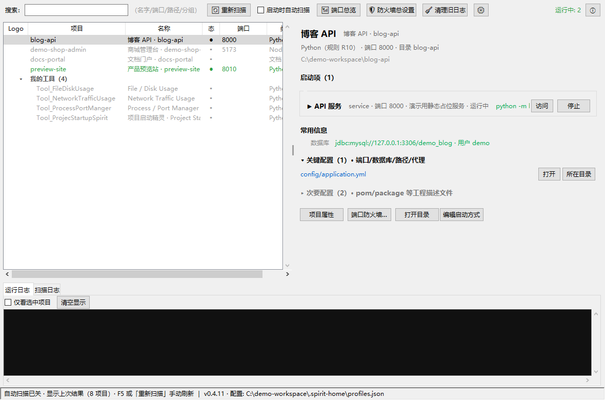

# 项目启动精灵（Project Startup Spirit）

中文 | [English](README.en.md)

> 一个"扫描工作区、一键启动任何项目开发环境"的桌面小工具：自动识别每个项目该怎么启动（bat / npm / mvn / node / 静态页 / 自带运行时……），双击即起服务、开浏览器、管端口。免安装、拷走即用。



## 当前状态

| 项 | 值 |
|---|---|
| 版本 | **v0.4.22 已实现**（2026-10-03，Python 3.8+ / tkinter / psutil） |
| 代码 | main.py + core/（13 模块）+ app/（3 模块）+ tools/selftest.py |
| 检测回归 | **selftest 34/34 通过（附录 A 符合率 100%，达标线 90%）+ v0.2 元数据不变量 + v0.2.4 日志不变量 + v0.4.2 nginx 不变量与真实配置校准 + v0.4.3 R12 不变量 + v0.4.4 分组/身份键不变量（含 v0.4.5 站点组名）+ v0.4.6 防火墙不变量（纯函数）+ v0.4.7 端口不变量（under_dir 路径判定 / listen_map 真实套接字快照 / manual_split 多路径）+ v0.4.8 nginx 引用行不变量（group_refs 合并/去重/分组；v0.4.13 补 ref 自带 conf）+ v0.4.9 nginx 排除不变量（filter_excluded normcase 精确匹配/保序/边界）+ v0.4.10 界面语言不变量（tr 字面量全收录/占位符跨语言一致/映射值有词条/缺键回落行为）+ v0.4.12 启动器不变量（预检拦截人话/本地脚本跳过/node 回退解析/未命中不缓存）+ v0.4.14 组合类型不变量（type_mix 混栈序/同类型合并/非栈排除/recompute 守卫）+ v0.4.15 Docker 不变量（ps/端口/挂载解析与归一四形态 / D1-D3 关联纯函数 + 真机校准）+ v0.4.16 引用行不变量补可能关联滤除（默认行为不变 / 滤后只剩真实托管 / 滤空 conf 整组消失 / 混合行不误滤）+ v0.4.17 状态轮询不变量（normalize_poll_seconds 合法直通/垃圾回落/双端 clamp/默认表）+ v0.4.18 防火墙不变量（desc 不含 netsh 拒绝字符 / 分隔符往返 / Profile=0→全部）+ v0.4.20 局域网访问不变量（npm run/vite 识别与词边界 / --host 注入判重 / package.json 双条件 + cwd 回落 / 开关门控）+ v0.4.21 便携环境不变量（portable_dirs 文本解析/三布局展开 / extra_dirs 先于 PATH 且绕缓存 / JAVA_HOME 检出 / 子进程 PATH 前置 / preflight 同口径）+ v0.4.22 便携环境展开加深不变量（整包根直填至三级 / bin·点目录不深入 / 深层 JDK 检出）通过** |
| v0.4.22 新增 | **便携环境展开加深，对齐 Tool_PortableEnvironment（docs/07 v0.4.22、docs/08 §13）**：Tool_PortableEnvironment 交出第一版便携环境后对照发现，env.bat 通配 `runtime\java\<任意名>\bin` 支持任意名 JDK 解压，而精灵 v0.4.21 的展开只到一级子目录——实测配置 `...\runtime` 命中 Node/Python、配置整包根全不命中、JDK 槽位永远够不到。`portable_search_dirs` 展开加深至**三级子目录 + 各级 bin**（bin 与点目录不再深入），`java_home_from` 复用同一展开：设置里**整包根直填**即可全命中（`runtime\node` 二级、`runtime\java\<名>\bin` 三级），与 env.bat 行为对齐；真实环境包实测 node/npm/python 全部命中便携版。适配只在精灵侧（消费方容忍布局），env.bat/README 零改动 |
| v0.4.21 新增 | **便携环境路径（docs/04 设置表、docs/08 §13、docs/07 v0.4.21）**：精灵拷走即用，但项目的工具（Node/JDK/Maven…）不在精灵身上——换机后没装工具项目就起不来（为 Tool_PortableEnvironment 便携环境包预留的配置面）。设置新「便携环境」区块（局域网访问后）：`settings.portable_env` 多行目录清单（每行一个 + 「添加目录…」，默认空零迁移，不校验存在性）。启动/预检时这些目录**先于系统 PATH** 解析依赖：`portable_dirs`（引号/空白容忍、`%VAR%`/`~` 展开、**相对路径锚精灵所在目录**——精灵连同 `portable\node` 拷走配置不用改）→ `portable_search_dirs`（根 + 一级子目录 + 子目录 `bin`，便携 node 目录/整包/JDK 根三布局通吃）→ `which_first(cmd, extra_dirs)` 便携 → PATH → node 回退（extra_dirs 绕缓存）；`preflight`/`launch` 同口径传参，便携环境能启动就不会被预检拦下；spawn 时子进程 **PATH 前置**便携目录 + 检出 JDK 补 `JAVA_HOME`——npm run 派生的 node/vite、脚本裸调 java 整条链都看得见。selftest 新增 `check_portable`；沙盒端到端冒烟：子进程内 `where node.exe` 首个命中便携 node（排在本机真 node 之前）、JAVA_HOME 指向便携 JDK |
| v0.4.20 新增 | **局域网访问：--host 通用开关 + 防火墙开通提示（docs/04 设置表、docs/08 §9、docs/07 v0.4.20）**：局域网访问 = --host 监听 + 防火墙放行（+ 端口没漂走）三件事，此前精灵只管防火墙一件——Vite dev server 默认只监听 localhost 回环，G_EmpiresLike 经 `192.168.232.129:5173` 本机/局域网都打不开，G_DungeonLike 更因 5173 被占被 Vite 顺延到 5200/5233。① 设置新「局域网访问」区块（状态刷新后）：「启动 Vite 服务时自动监听所有网卡（注入 --host）」开关（默认关，`settings.lan_auto_host` 零迁移）——开启后启动 `npm run <script>` 且 package.json 里 vite 依赖 + 该 script 以 vite 为入口**双条件命中**时自动注入 `-- --host`（已带 --host 判重；注入在 `_resolve_exe` 之前——解析后 npm.cmd 被包成 `cmd /c …` 就认不出形态；nodemon 等其他 dev 工具不碰）；② 防火墙对话框写入成功后，检测到项目存在"Vite dev 且未带 --host"的生效启动项且开关未开 → 弹窗询问开启（说明下次启动生效、运行中服务需停止再启动）；③ selftest 新增 `check_lan_host`。边界：开关全局粒度；端口被占时 Vite 仍自动顺延，防火墙按实际端口开放 |
| v0.4.19 新增 | **详情/属性名称与路径可选中复制（docs/04 §2/§4.5、docs/07 v0.4.19）**：详情页显示名、副标题（`类型（规则）· 端口 · 目录 文件夹名`）、完整路径行与项目属性的「目录: 文件夹名」原先全是 `tk.Label`（天生不可选中文本，复制只能手抄），现换用新增 `app/widgets.selectable_entry`——扁平只读 `tk.Entry`（relief=flat、无边框高亮、底色同面板），外观与 Label 无差异，但可像文本一样拖选、双击选词、三击/Ctrl+A 全选、Ctrl+C 复制；宽度按 CJK 加权估算防中文截断。**交互变化**：路径行「打开目录」从单击改为**双击**（单击让位给选中文本），悬停有提示；启动项卡片命令行与 nginx/Docker 区行内信息暂不换（需要时照此推广） |
| v0.4.18 修复 | **防火墙写入真机双坑（v0.4.6 起"添加规则"从未真正成功过）**：用户首用报「未完成：未获得管理员授权（UAC 被取消）」且**全程无 UAC 弹窗**。真机诊断出两层叠加根因：① `rule_desc` 分隔符 `|` 被 netsh add rule 拒绝（实测报"描述包含无效的字符，或具有无效的长度"）——规则根本建不成，分隔符改 `;`（身份键来自 Windows 目录名天然不含 `;`，精确往返不受影响）；② 结果文件必须**预创建**——Python 3.12+ `tempfile.mkdtemp` 受限 ACL（OWNER RIGHTS，无用户 ACE）下提权进程新建的文件所有者落 Administrators，精灵（非提权）读回必被拒（Errno 13），被误报成"UAC 被取消"；预创建让所有者留在精灵一侧，提权脚本只覆盖写。**UAC 不弹窗本身不是 bug**：`ConsentPromptBehaviorAdmin=5`（Win10+ 默认）下微软签名的 powershell 静默自动提升，「始终通知」级别机器才弹窗。顺带：`profile_label` 对 netsh profile=any 读回的 Profile=0 显示「全部」；回读失败兜底消息改为"命令已发送，但无法回读执行结果…"。selftest `check_fw` 补 desc 字符/往返与 Profile=0 断言；真机端到端：写入→list_rules 读回→清理往返全绿（docs/07 v0.4.18） |
| v0.4.17 新增 | **运行状态轮询可配置（docs/04 §2/§4.3、docs/07 v0.4.17）**：主窗口状态点轮询此前硬编码 2 秒自续，现开放到设置——新「状态刷新」区块（Docker 区之后）：「运行状态自动刷新」开关（默认开）+「刷新间隔（秒）」Spinbox 1~60（默认 2）；`settings.status_poll_enabled` / `status_poll_seconds` 零迁移，`profiles.normalize_poll_seconds` 纯函数兜底（垃圾输入回落 2、越界 clamp 1~3600）；保存经 `on_poll_changed` 回调立即重排定时器**无需重启**；关 = 不再周期轮询（启动/重扫完成时的一次性状态快照保留），端口总览对话框的自动刷新独立不受影响。selftest 新增 `check_poll_settings` |
| v0.4.14 新增 | **详情页组合类型**：前后端混合项目的详情副标题把技术栈类型全部列出（如 `Java+Node（规则 R3/R4）`），列表类型列维持单类型不变（`Java ·2`）；`detector.type_mix` 纯函数按项目类型优先级取去重类型集合，**R1 辅助脚本/R12 打包成品不算栈**（带个 gen-widget-pack.ps1 的 Node 项目不会变成"Node+脚本"），空/纯非栈回落单类型；组合类型原始值与显示名进搜索 blob（"Java+Node" 可搜）。recompute_type 重构为查同一优先级表（行为不变，34/34 守护）；selftest 新增 `check_type_mix` 4 段 |
| v0.4.15 新增 | **Docker 容器关联与启停**（core/dockman + docs/02 §10 D 系规则）：① **看得见**——扫描时问 Docker 本人（ps/inspect 输出 JSON）：D1 conf 挂载（nginx.conf 被容器挂载 = "在用"凭据，详情页 nginx 区标注「容器 X（状态 · 扫描时）」，无容器挂载则标注「可能未在用」）、D2 端口发布（宿主端口命中项目端口 → 可能关联；外部运行感知备注升级为「由 Docker 容器发布」且永不给结束进程）、D3 目录挂载（挂载源落在项目内 → 确证关联）；详情页新增 Docker 区块，容器名/镜像可搜索；② **管得了**——项目/站点/引用行右键 + 详情页按钮启停**关联到的**容器（停止弹确认，docker start/stop 后台执行、就地回写状态）；引擎没跑给「启动 Docker Desktop」一键拉起（等待就绪 ≤90s 后自动重扫）；引擎 off/down 时不写不删上次关联。边界：nginx 进程仍不管理（v0.4.2 前例收窄）；容器是系统状态不随 profiles 走（docs/08 §12） |
| v0.4.16 新增 | **"可能关联"引用行显示开关**：nginx 分组里仅按端口推测的关联条目（N2 proxy-only）默认**不再显示**——同一端口常被多个项目声明，项目拷贝会整批出现在分组里（实测 F:
ginx.conf 分组的引用行从 4 条降到 0 条，全组只剩 3 个合成站点；D 盘分组保留 2 条真实托管行）。`ngxscan.group_refs` 加 `include_possible` 参数（False 滤 proxy-only 行、host+proxy 混合照留、滤空 conf 整组不出现）；`settings.nginx_show_possible` 默认 false 零迁移；设置对话框 nginx 区勾选「列出仅按端口推测的关联条目」恢复全量 |
| v0.4.13 修复 | **nginx 引用行 iid 塌缩致列表刷新崩溃（按钮不翻转的元凶）**：`group_refs` 的 ref 字典缺 `conf` 字段（conf 只是外层键），GUI 引用行 iid `r::conf|key` 实际恒为裸 key——工作区出现被**两份 nginx.conf**（D:\Program Files\nginx 与 F:\nginx.conf）同时引用的项目（"…- 副本"）即插出重复 iid，`_refresh_list` 抛 TclError：扫描完成那次刷新起**所有按钮/状态点/运行计数全部不再更新**（点启动后按钮停在"启动"，再点一次按内部状态走了停止分支把刚起的服务杀了）；且坏数据先落缓存后刷新，**重启精灵会在启动时崩**。修复：ref 自带 conf（iid 恢复 conf|key 唯一）+ 插入防重兜底；**顺修** `_ref_menu`「打开配置文件」因同一缺字段自 v0.4.8 起从不显示。selftest `check_nginx_refs` 补第 4 段（ref 自带 conf/跨 conf 同项目各行不串）；真实 86 项目数据启动 + 渲染 + 注入运行态全链路验证通过 |
| v0.4.12 新增 | **启动器依赖解析加固**（docs/07 v0.4.12）：修复「启动 G_EmpiresLike / G_DungeonLike 失败：WinError 2 系统找不到指定的文件」——nvm4w 机器系统 PATH 写 `%NVM_HOME%;%NVM_SYMLINK%`，个别启动链路的进程环境不展开该 REG_EXPAND_SZ，`shutil.which('npm.cmd')` 恒空（磁盘上 node 完好）。两层修复：① `launcher.which_first` PATH 落空时 node 家族（node.exe/npm.cmd/npx.cmd）回退解析——`%NVM_SYMLINK%`/`%NVM_HOME%` expandvars → 注册表 InstallPath → 常见安装位，纯文件存在性判定，且**未命中不缓存**（装好依赖重试即生效，无需重启精灵）；② preflight 依赖探测改为「首词不是项目内本地文件才查 PATH」——PATH 工具缺失给人话提示（"{0} command not found…"）而非放行到 spawn 报 WinError 2（v0.4.11 及此前 .cmd/.exe 一律跳过探测正是漏洞）。selftest 新增 `check_launcher_pre`；本机坏 PATH 环境端到端冒烟通过（真起 vite :5173 → 正常停止） |
| v0.4.11 新增 | **工具栏按使用频率重排 + 设置/关于图标化**（docs/04 §1）：按钮从左到右 = 🔄 重新扫描 →（启动时自动扫描开关）→ 📶 端口总览 → 🛡 防火墙总设置 → 🧹 清理旧日志 → ⚙ 设置（图标按钮，倒数第二）→ ⓘ 关于（图标按钮，最右角）；低频按钮收成图标后悬停有文字提示（tkinter 最小 tooltip 实现）；「关于」对话框新增 **GitHub 项目主页链接**（点击用默认浏览器打开） |
| v0.4.10 新增 | **界面语言切换（简体中文 / English，docs/04 §4.3、docs/07 v0.4.10）**：设置里「界面语言」下拉（`settings.language`），保存后询问一键重启生效（GUI 按语言一次性构建，不做热切换）；架构英文作键、**缺键一律回落英文**（国际用户始终可读）、语言注册表驱动——再加第三种语言 = 注册表加一行 + 一个词典，零结构改动；detector/ngxscan 写进缓存的历史中文生成值（label/note/类型）存储不变，仅显示层映射；搜索 blob 中英双标签两种界面都可搜；`core/i18n` 纯函数模块 + selftest `check_i18n` 强校验（简体界面不缺中文）。**顺带**：`paths.app_dir()` 支持 `SPIRIT_HOME` 环境变量重定向（演示截图/隔离测试），README 双语化 + 演示截图（`tools/make_screenshots.py` 全沙盒假数据生成） |
| v0.4.8 新增 | **nginx 分组引用行**：被真实项目"认领"的 nginx 关联（N1/N2）也进 nginx 分组——`↗ 项目名` 交叉引用行（类型列 `已关联 · 托管/反代`，状态点跟随目标项目），与"仅 nginx 站点"明显区分；**只有引用行没有站点的配置照常建组**（如在用的 Windows 裸装 nginx，原先列表零可见）。同项目同配置多条关联合并一行（`ngxscan.group_refs` 纯函数）；双击引用行跳转到目标项目并打开详情，右键可打开访问地址/跳转/打开配置文件；不可启动、不可拖动。开关：随「扫描系统 nginx 配置」，「列出仅 nginx 站点」关闭后引用行仍在（docs/02 §9.5、docs/04 §4.9、docs/07 v0.4.8） |
| v0.4.9 新增 | **nginx 配置排除机制**：设置里「排除的 nginx 配置」多行框 + 「勾选要排除的配置…」弹窗勾选，被排除的配置彻底不参与关联扫描（手动指定的同样生效、排除优先），扫描日志注明，全部被排除有专门提示；`ngxscan.filter_excluded` 纯函数 normcase 整路径精确比对。**顺修两处 v0.4.7 回归**：① apply 手动框留空时自动探测整条丢失（nginx 关联恒为空——此前"缓存 nginx 全空"疑团即此）；② "部分手动路径无效"提示被吞永不显示（docs/02 §9.6、docs/07 v0.4.9） |
| v0.4.7 新增 | **运行感知**（能看出哪些程序已被启动、哪些端口已被占用）+ nginx.conf 可配置多个：① **外部运行感知**——列表状态点新增蓝 ○，端口在监听但不是精灵启动的项目亮蓝（自己在终端/IDE 起的服务、nginx/docker 在服务的站点）；判定不只看端口（21 个 Vite 项目共用 5173，纯端口会全部误点亮）：监听进程 cwd/exe 在项目目录内才算确证，进程路径读不到才按端口推断，其余算"端口被占"不算运行；工具栏计数显示"运行中: N（外部 M）"。② **外部项目「结束进程」**（确证命中限定）——与精灵「停止」区分：弹确认框 → 树杀监听进程 → 复核端口释放；推断命中与 nginx 站点不给结束（防误杀），「全部停止」不批量动外部进程。③ **「📶 端口总览」**（工具栏）——本机全部监听端口 × 项目归属一屏（端口/监听地址/进程/PID/归属/是否精灵管理），2 秒自动刷新。④ **nginx.conf 手动指定可多个**——设置改多行文本（每行一个、浏览可多选），有效份全解析、部分无效忽略并列进扫描日志、全部无效仍不回落自动探测（docs/04 §4.8、docs/07 v0.4.7、docs/08 §10） |
| v0.4.6 新增 | **端口防火墙管理**（core/fwman + docs/04 §4.7）：① 单项目「端口防火墙…」（详情按钮/右键）——把项目端口写成 Windows 防火墙**入站允许**规则，局域网/远程可访问；端口多选（检测值预勾）、协议、远程范围（默认仅局域网=本地子网，可选所有地址/自定义 IP 段）、配置文件；写入幂等（先删同名再加）。② 工具栏「🛡 防火墙总设置」——全机精灵规则总览（项目/端口/协议/远程/状态），批量启停/删除/一键清空/跳系统面板；**只识别、只动精灵自己的规则**（名称 `启动精灵_` 前缀 + 描述标记双重凭据）。③ 读写机制：读走 COM 免管理员（输出 JSON，不碰本地化 netsh 文本）；写走 netsh 打包 ps1 + 一次 UAC 批量授权，结果逐条回读；profiles 记"上次配置"意图预填。规则是系统状态，不随精灵文件夹走（docs/05 §1 边界） |
| v0.4.5 新增 | **仅 nginx 站点默认分组**（docs/02 §8.5）：`Nginx_` 合成站点默认归入 `nginx` 组；本机有多份在用 nginx 配置时按来源分 `nginx(来源 conf 路径)` 组（`ngxscan.site_group` 纯函数，conf 缺失为 `nginx(?)`）；nginx 组不受退化平铺影响，单根工作区里站点单独成组、其余项目照旧平铺；手工分组/`"-"` 哨兵对站点同样优先。自动分组名纳入搜索（工具栏"按分组过滤"对自动组生效） |
| v0.4.4 新增 | **默认分组与同名项目身份键**（docs/02 §8.5）：① 分组三档——手工分组 ＞ 自动按父文件夹（= 扫描根，多根才显现组头）＞ 退化平铺（单根工作区观感与旧版完全一致）；属性对话框留空=自动、`"-"`=显式不分组、拖到自动组头=固定为手工组。② 身份键——跨扫描根同名项目时按根序首个保留裸名、后续升级「根名/项目名」，档案/缓存/日志按键隔离，启动项 id（rid）随 key 改写保证全局唯一；无重名时 key==项目名，**旧 profiles.json/scan_cache.json 零迁移兼容**。已知限制：端口知识库仍按裸项目名共享 |
| v0.4.3 新增 | ① **R12 打包成品**：项目 `dist/` 一层内的 exe（PyInstaller/.NET 发布等）作为附加启动项与源码启动并列（排除 createdump.exe 与安装器特征名；`build/windows/` 仍归 R5 Godot）；缓存 fmt=4。② **启动失败不再一闪而过**：app 型（含打包 exe、java -jar）输出改为捕获（stderr 并入同管道，报错进运行日志）；独立控制台方式秒退且 exit≠0 时弹窗提供「捕获重跑」（force_capture 强制捕获模式重跑一次拿报错）；Popen 本身失败（文件被移动等）弹人话错误不闪崩。③ 附录 A 按工作区实况修正：28→34 项目（Tool_PromptKit→Tool_PromptKit 改名；新增 DOC_LabPlatformDocs / G_PlaybookInsights / Tool_DupFinder / Tool_FileDiskUsage / Tool_NetworkTrafficUsage；本项目补入表内） |
| v0.4.2 新增 | nginx 关联检测（docs/02 §9 N 系规则）：扫描系统 nginx 配置（可开关；多份在用则全部解析、备份目录过滤、可手动指定路径），N1 路径关联（root/alias 落在项目目录 → 详情页"nginx 托管前端"，含访问地址/root 位置/来源配置）、N2 端口关联（proxy_pass → 本地端口命中项目 → 后端标"被 nginx 反代"，双向展示）、N3 仅 nginx 站点（可开关；`Nginx_` 前缀合成项目，启动=打开访问地址，不管理 nginx 进程）；自研轻量 conf 解析器（注释/引串/include glob/upstream，零依赖） |
| v0.4 新增 | R4 加 spring-boot 插件门槛（多模块 Maven 只列可运行模块，ModularSuite 8→1）+ 后端服务标签规则；「访问」按钮（启动/访问分离）；控制台显示方式总设置（集中运行窗/各弹原始控制台）；配置分关键（默认展开、可折叠）/次要（默认折叠）两栏；「关于」对话框（作者占位 xxxxx）；docs/08 使用与原理说明 |
| v0.3 新增 | Logo 独立列（列表平铺化、分组头行可折叠）、详情页常用信息（数据库连接/前端代理，不显密码）、配置文件列表（默认打开/资源管理器定位） |
| v0.2 新增 | 启动时自动扫描开关（关=缓存直读）、项目分组、中/英文名标注（扫描猜预设）、Logo 显示、列表端口列、搜索增强（名/端口/路径/分组/类型） |
| v0.2.1 修订 | 项目列恢复文件夹名 + 新增"名称"列（中/英文名/猜测）、列头点击排序（分组同步反向）、启动项卡片按钮固定右侧不被长文本挤出、列表窄窗口横向滚动 |
| v0.2.2 修订 | 手动排序为默认：拖动排位/入组/调分组序 + 右键上移下移（顺序存 profiles.order），列头点击改三态（升→降→回手动序） |
| v0.2.3 修复 | 前端页面打不开：Vite 6 只监听 ::1，URL 全面改用 localhost；npm.cmd 不再误判"交互 bat"（输出可捕获、端口可回读）；已知端口服务改为端口监听后才开浏览器 |
| v0.2.4 新增 | 每项目"控制台日志"配置（项目属性里）：输出到指定目录日志文件的开关（默认关）+ 目录（空=默认 logs/）+ 保留天数（默认 365，0=不清理）。开的项不再滚入公共运行日志（只留一行路径提示，文件即缓冲）；文件名时间戳制 `{项目}_{yyyyMMdd_HHmmss}.log`、跨天自动切、1MB 分卷；启动时零清理扫描，工具栏【🧹 清理旧日志】按钮手动按日期全量清理（只动标准命名文件）；运行日志页加"仅看选中项目"过滤与"清空显示" |
| v0.2 修复 | R4 优先使用项目自带 `.tools/maven`（3.9.9，与运行手册一致），避免 PATH 上 Maven 3.6.3 换版本触发 `~/.m2` 重复下载；无 `.tools` 的项目（P_MobileLabNotes）仍用 PATH 的 mvn |
| 已验证 | 扫描 34 项目、启停链路（node 服务起→日志回读端口→树杀→端口释放）、内置静态服务、覆盖锁定、扫描缓存、GUI 冒烟与端到端、v0.2 冒烟 28 项、v0.3 冒烟 24 项（logo 列/折叠/详情区块/排序回归）、v0.4.2 nginx 端到端（本机两份在用配置：N1 命中 202511_harbor 与 Q7 web-office-suite、N2 命中 P_CityTwin:8090 反代、N3 出 3 个 Docker 站点；缓存往返/开关清空/GUI 冒烟）、v0.4.3 启动失败链路（app 型 stderr 崩溃输出捕获、Python traceback 捕获、交互 bat 捕获重跑、Popen 失败人话提示）、v0.4.6 防火墙冒烟（COM 读链路、两对话框构建与异步刷新、意图记忆预填回显、非提权 ps1 全链路失败路径逐条回读）、v0.4.7 运行感知冒烟（84 项目外部判定仅命中真实在跑的 G_BlockWorldLike:5173、端口总览 33 行 × 归属汇总正确、设置多行 nginx 路径回显正常、外部结束端到端：真实 http.server 确证命中→结束进程→端口释放→状态回落）、v0.4.15 Docker 冒烟（引擎 up 下 box 容器识别与 10100 发布端口表正确、F:
ginx.conf 站点详情"未发现挂载"标注、假注入 D3 项目渲染区块/按钮/右键菜单、引擎 down 模拟出「启动 Docker Desktop」菜单项、box 容器停止→启动往返：弹确认/状态回写 exited→running/运行日志两行/引擎恢复 up）、v0.4.16 可能关联开关冒烟（默认引用行 8→2 条只剩真实托管、F:
ginx.conf 分组引用行清空组随站点保留、勾选后恢复 8 条）、v0.4.18 防火墙真机链路（非提权 apply_ops 真写规则→list_rules 读回 desc `项目启动精灵管理;键` 与端口/协议/范围→remove 清理复核消失，全程无 UAC 弹窗=Consent=5 静默提升；修复前同链路报"未获得管理员授权"且规则不存在） |
| 待办 | PyInstaller 打包实测（build_windows.bat 已备）、docs/01 §5 第 6 条干净机验收 |

## 快速开始

```
pip install -r requirements.txt   # 只有 psutil
python main.py                    # 开发态运行
python tools/selftest.py          # 检测规则回归（对照 docs/02 附录 A）
build_windows.bat                 # 打包单文件 exe → dist\项目启动精灵.exe
```

首次运行自动扫描 `F:\Workspace\Space_Zcode`（可在设置里改；工具栏可关闭"启动时自动扫描"，关闭后启动直接显示上次结果），双击列表项即启动；右键有项目属性（中英文名/分组/Logo）/停止/重启/编辑启动方式/打开目录/端口防火墙。列表显示每个项目配置的端口，搜索框可按名字/端口/路径/分组过滤；局域网/远程访问不了服务时，用「端口防火墙…」把端口开进 Windows 防火墙，工具栏「🛡 防火墙总设置」统一管理所有已开的规则。**界面语言**：设置里「界面语言」可切 简体中文 / English（保存后询问重启生效；未翻译处回落英文）。所有配置写在 exe（或 main.py）旁边：`profiles.json`、`scan_cache.json`、`logs/`。

## 它解决什么问题

工作区里的项目越来越多，启动方式却各不相同：

- 有的双击 `启动.bat`，有的要 `npm run dev`，有的是 `mvn spring-boot:run`，有的直接开 `index.html`；
- 前后端分离项目要**先后启动两个进程**（后端 + Vite 前端）；
- 端口大量复用：5173 被 4 个前端共用、8080 被 3 个后端共用、8931 被 2 个 serve.js 共用，并行启动经常撞车；
- 起来之后是一堆黑窗，分不清哪个窗是哪个项目，关也关不干净（子进程残留）。

**项目启动精灵**把"哪个项目怎么启动"这件事统一管起来：扫描 → 识别 → 双击启动 → 状态可见 → 一键停干净。

## 文档导航

| 文档 | 内容 |
|---|---|
| [docs/01-需求与用户场景.md](docs/01-需求与用户场景.md) | 痛点、8 个用户场景故事、非目标、v0 验收标准 |
| [docs/02-项目检测规则设计.md](docs/02-项目检测规则设计.md) | **核心篇**：检测规则优先级表 R1~R12 + N 系 nginx 关联（§9）、启动项/启动组概念、全工作区预期检测结果表（34 项目） |
| [docs/03-架构与模块设计.md](docs/03-架构与模块设计.md) | 架构图、模块职责与接口草案、启动链路时序、进程/端口策略、技术选型论证 |
| [docs/04-界面设计.md](docs/04-界面设计.md) | 主窗口线框图、交互定义、状态色约定 |
| [docs/05-数据与配置设计.md](docs/05-数据与配置设计.md) | profiles.json / 扫描缓存 / 日志文件设计，便携铁律 |
| [docs/06-打包与分发方案.md](docs/06-打包与分发方案.md) | PyInstaller 构建脚本草案、"拷走即可用"验收清单 |
| [docs/07-路线图.md](docs/07-路线图.md) | v0 → v2 分期计划，每期验收标准 |
| [docs/08-使用与原理说明.md](docs/08-使用与原理说明.md) | **面向使用者**：扫描/启动/界面功能怎么用、怎么想的（v0.4.3） |
| [AGENTS.md](AGENTS.md) | 给 ZCode 接力用：任务背景、文件地图、如何继续 |

## 路线图摘要

| 版本 | 主题 | 内容 |
|---|---|---|
| v0.4.22 | 便携环境对齐 | 展开加深至三级子目录 + 各级 bin：设置里 `Tool_PortableEnvironment` 整包根直填即全命中（`runtime\node` 二级、`runtime\java\<任意名>\bin` 三级，与 env.bat 通配对齐），bin/点目录不深入 |
| v0.4.21 | 便携环境路径 | 设置「便携环境」目录清单：启动/预检先于系统 PATH 解析便携 Node/JDK/Maven（根 + 一级子目录 + 子目录 bin 三布局），子进程 PATH 前置 + 按需设 JAVA_HOME；相对路径锚精灵目录，连环境一起拷走即用（docs/08 §13） |
| v0.4.20 | 局域网访问 | 设置「局域网访问」开关：启动 Vite dev 自动注入 `-- --host`（npm run + vite 双条件判定、判重），局域网机器可访问；写入防火墙规则后检测到缺 --host 主动弹窗提示开启 |
| v0.4.19 | 可复制信息 | 详情页/项目属性里的名称、路径、目录名改为可选中复制（扁平只读 Entry）；路径行改双击打开目录 |
| v0.4.18 | 防火墙修复 | 修复 v0.4.6 起"写入防火墙规则"从未真正成功：desc 分隔符 `|` 被 netsh 拒绝改 `;`；提权结果文件预创建（Python 3.12+ mkdtemp 受限 ACL 下读回被拒不再误报"UAC 被取消"）；Consent=5 机器静默提升不弹窗属正常 |
| v0.4.17 | 轮询可配置 | 运行状态自动刷新可在设置开关、间隔 1~60 秒可调（默认 2 秒，`settings.status_poll_*`），保存立即生效无需重启；关后保留启动/重扫时的一次性状态快照 |
| v0.4.16 | 关联降噪 | nginx 分组"可能关联"（仅端口推测）引用行默认不显示（`settings.nginx_show_possible`），真实托管行不受影响，设置可恢复全量 |
| v0.4.15 | Docker 容器 | 容器↔项目/nginx 配置关联（D1 conf 挂载/D2 端口发布/D3 目录挂载）+ 关联容器右键/详情页启停（停止弹确认）+ 引擎未跑一键拉起 Docker Desktop；外部感知备注升级「由容器发布」 |
| v0.4.10 | 界面语言 | 简体中文 / English 切换（`settings.language`，重启生效；英文作键缺键落英文，语言注册表 N 语言架构）+ `SPIRIT_HOME` 隔离 + README 双语 + 演示截图 |
| v0 | 首版可用 | 扫描 + 检测（规则 R1~R9）+ 一键启动/停止 + 端口冲突提示 + 日志窗口 + 内置静态服务器 |
| v0.4.2 | nginx 关联 | 扫描系统 nginx 配置：托管前端/反代后端双向关联、仅 nginx 站点、访问地址一键打开 |
| v0.4.7 | 运行感知 | 外部运行感知（蓝 ○：不是精灵启动但在监听的项目端口，按监听进程 cwd/exe 归属确证）+ 外部项目「结束进程」（确证限定，弹确认后树杀+端口复核）+「📶 端口总览」（全机监听端口 × 项目归属）+ nginx.conf 手动指定可多个 |
| v0.4.8 | 引用行 | nginx 分组下列出已关联到真实项目的引用行（`↗ 项目名`，托管/反代标注，双击跳详情、右键开地址），纯引用配置（如裸装 nginx）也获得可见分组 |
| v0.4.9 | 配置排除 | 散落 nginx.conf 手动勾选排除（normcase 精确匹配，日志注明；手动指定同样受约束）；顺修 apply 留空即丢自动探测与无效提示被吞两处回归 |
| v0.4.6 | 端口防火墙 | 项目端口一键写入 Windows 防火墙入站允许（局域网/远程可访问）+ 精灵规则总设置（总览/启停/删除） |
| v0.4.5 | 站点分组 | 仅 nginx 站点默认归 `nginx` 组；多份配置按来源分 `nginx(配置路径)` 组，不受退化平铺影响 |
| v0.4.4 | 分组与身份键 | 默认按父文件夹（扫描根）分组（三档：手工＞自动＞退化平铺）；跨根同名项目身份键「根名/项目名」，rid 全局唯一 |
| v0.4.3 | 成品与报错 | dist/ 打包成品 exe 启动项（R12）；启动失败抓报错（app 型捕获 + 闪退捕获重跑） |
| v0.5 | 顺手好用 | 启动项编辑/自定义命令、收藏与最近、前后端组合一键、端口自动顺延 |
| v1 | 启动可靠 | URL 健康检查后才开浏览器、外部依赖探测（node/mvn/jdk）、扫描排除规则可配置 |
| v2 | 锦上添花 | 启动分组、开机自启、（可选）跨平台 |

详见 [docs/07-路线图.md](docs/07-路线图.md)。

## 设计原则

1. **检测只是建议，人永远是最终决定者**——自动识别错了，右键改掉，下次记住（profiles.json 覆盖）。
2. **零依赖、拷走即用**——单文件 exe，所有配置和日志写在 exe 旁边，不碰注册表、不写 AppData。
3. **不重复造轮子**——通用进程/端口管理已有 Tool_ProcessPortManger，本工具只管"项目的启动方式"。
4. **优先尊重项目自己的启动入口**——项目里已有 `启动.bat` 的，直接执行它，而不是绕过它自己拼命令。
