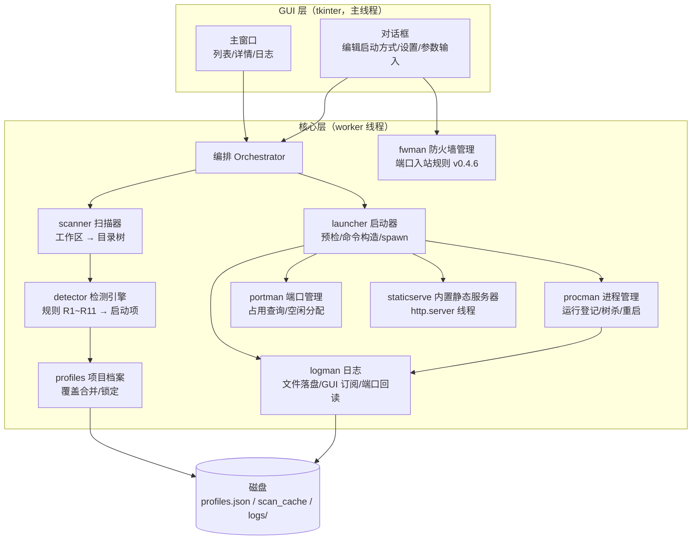
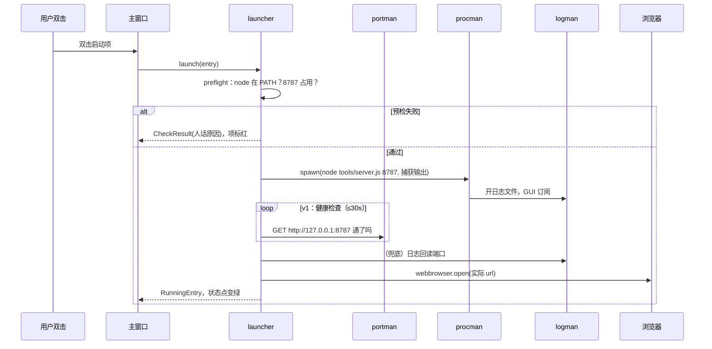

# 03 · 架构与模块设计

> **本文档是概念架构设计，本轮不实现代码**（沿用 Tool_ChoiceKit 的设计先行惯例）。接口以 Python 函数签名草案的形式给出，供 v0 实现时直接对照。

## 1. 总体架构



要点：

- **GUI 与核心严格分层**：tkinter 只在主线程跑，扫描、日志读取、健康检查都在 worker 线程，经 `queue.Queue` 把事件投递回主线程刷新界面——避免"扫描 28 个项目时窗口卡死"。
- **检测引擎是纯函数集合**：`detect(dir) -> [LaunchEntry]` 不碰磁盘以外任何状态，天然可单测（对照 docs/02 附录 A 逐行验证）。
- **内置静态服务器**是精灵自己进程里的 http.server 线程，绑定 127.0.0.1——服务 PWA/静态项目时**不产生外部进程**，也避开 Windows 防火墙弹窗。

## 2. 代码结构（目标布局）

```
Tool_ProjecStartupSpirit/
├── main.py                # 入口：装配各模块 + tk 主循环
├── app/                   # GUI 层
│   ├── main_window.py     # 主窗口（列表/详情/日志）
│   └── dialogs.py         # 编辑启动方式、设置、script 参数输入
├── core/
│   ├── scanner.py         # 工作区扫描 → 目录树（含缓存）
│   ├── detector.py        # 规则 R1~R11 → LaunchEntry 列表
│   ├── ngxscan.py         # nginx 关联检测（v0.4.2，docs/02 §9 N 系规则）
│   ├── profiles.py        # profiles.json 读写、覆盖合并
│   ├── launcher.py        # 预检 → 命令构造 → spawn → 开浏览器
│   ├── procman.py         # 运行登记簿、状态轮询、停止/重启
│   ├── portman.py         # 端口占用查询、空闲口分配
│   ├── fwman.py           # Windows 防火墙规则管理（v0.4.6）
│   ├── dockman.py         # Docker 容器关联与启停（v0.4.15，docs/02 §10 D 系规则）
│   ├── logman.py          # 每项目日志文件 + GUI tail + 端口回读
│   └── staticserve.py     # 内置静态服务器线程
├── tools/
│   └── selftest.py        # 自测：检测规则对照附录 A 跑全工作区
├── requirements.txt       # psutil（唯一第三方依赖）
├── build_windows.bat      # PyInstaller 打包
├── docs/                  # 设计文档（本轮产出）
└── README.md / AGENTS.md
```

## 3. 模块职责与接口草案

### 3.1 scanner · 扫描器

```python
@dataclass
class DirNode:
    rel: str            # 相对项目根的路径（""= 根）
    path: str

@dataclass
class ProjectDir:
    name: str           # 项目目录名
    path: str
    dirs: list[DirNode] # 根 + 白名单子目录（docs/02 §2）

def scan_workspace(root: str, cache: ScanCache | None = None) -> list[ProjectDir]
```

- 忽略：`.rar`、隐藏目录、`node_modules`、`__pycache__`、`.venv`、`_build`、`dist`、`chrome_profile`。
- 缓存：以目录 mtime 为键，未变化的目录复用上次检测结果（见 docs/05 §3）。

### 3.2 detector · 检测引擎（纯函数）

```python
@dataclass
class LaunchEntry:
    id: str                       # {项目名}/{相对目录}/{规则号}
    label: str
    kind: str                     # service|app|static|embedded|script
    cwd: str                      # 相对项目根
    command: list[str] | None     # static 型为 None
    port: int | None
    url: str | None
    confidence: str               # high|mid|low
    rule: str                     # "R1"~"R11"
    locked: bool = False          # 用户覆盖后锁定
    console: bool = True          # 是否显示控制台窗口（bat 交互型需要）

def detect_dir(path: str) -> list[LaunchEntry]   # 单目录，至多一条主规则
def detect_project(p: ProjectDir) -> list[LaunchEntry]  # 并集 + 组装启动组
```

规则实现形态：每条规则一个 `match(path) -> LaunchEntry | None`，按优先级顺序短路——新增规则（Unity/Rust/Docker…）就是加一个函数插进列表。

### 3.3 profiles · 项目档案

```python
def load(path: str) -> Profiles
def save(path: str, p: Profiles) -> None            # 原子写：tmp + replace
def effective(detected: list[LaunchEntry], p: Profiles,
              project: str) -> list[LaunchEntry]
    # 合并规则：locked 项 > 用户自定义项 > 检测项（见 docs/02 §5）
```

### 3.4 launcher · 启动器

```python
@dataclass
class CheckResult:
    ok: bool
    reason: str          # 人话：未找到 mvn 命令 / 5173 已被占用(P_FactoryFlow 前端)…

def preflight(entry: LaunchEntry) -> CheckResult
    # ① 依赖探测：command[0] 是否在 PATH（shutil.which，2s 超时，结果缓存）
    # ② node_modules 缺失提示（R3）
    # ③ 端口预检：占用者是谁（psutil → 进程名）

def launch(entry: LaunchEntry) -> RunningEntry
    # 预检 → 组装环境（cwd/编码 UTF-8）→ spawn → 登记 → 开浏览器
```

spawn 细节（Windows）：

| kind | 启动方式 | stdout/stderr |
|---|---|---|
| service | `CREATE_NO_WINDOW` + 管道捕获 | 写日志文件 + 推 GUI |
| service（console=True，**项目本地** bat/cmd，如 R1 启动.bat） | `CREATE_NEW_CONSOLE`（用户可见黑窗） | 不捕获，日志记录"已开独立控制台"；秒退且 exit≠0 时 GUI 弹"捕获重跑"（v0.4.3） |
| service（PATH 工具 .cmd，如 npm.cmd run dev） | 与普通 service 相同：`cmd /c <全路径>` 包装 + 捕获 | 写日志 + 端口回读（v0.2.3：vite 6 只监听 ::1，全靠 banner 回读/端口探测） |
| app | `CREATE_NO_WINDOW` + 管道捕获（v0.4.3，此前 `DETACHED_PROCESS` 不捕获） | 写日志——打包 exe/java -jar 崩溃报错不再"一闪而过" |
| script | `CREATE_NEW_CONSOLE` 或捕获（默认捕获） | 写日志 |
| static | `webbrowser.open(file:///…)` | 无进程 |
| embedded | 起 staticserve 线程 | 线程日志进日志区 |

v0.4.3 捕获与闪退处理补充：

- 捕获时 **stderr 一律并入 stdout 同一管道**（`stderr=STDOUT`）：崩溃栈多走 stderr，分开两根管道会漏读甚至撑爆死锁。
- `launch(force_capture=True)`（诊断重跑）：强制走捕获分支、不开黑窗。GUI 的闪退检测触发——独立控制台方式启动的项在 ~10s 内退出且 exit≠0 时弹窗询问，用户选"是"即以该模式重跑，报错抓进运行日志。
- `Popen` 本身抛 OSError（本地文件被移动、cwd 不存在等 preflight 漏检场景）：不炸 GUI，写人话日志（"启动失败：…"）并把该项置为 failed。
- 已捕获方式的失败：公共运行窗补一行红色提示"已退出（exit code N，存活约 X 秒）"，报错本身在运行窗/日志文件里。

浏览器打开时机（v0.2.3 起）：已知端口的服务等**端口真正 listen 且监听进程属于本次启动的进程树**再开（最长 30s）；无预设 url 的服务靠日志回读 `http://(127.0.0.1|localhost):port` 命中即开；两条路径共用一次性开关，不会开两次。

**URL 一律用 `http://localhost:{port}/`**（v0.2.3）：Vite 6 / Node 18+ 把 localhost 解析为 `::1` 且只监听 IPv6，`127.0.0.1` 会连接拒绝；浏览器对 localhost 会依次尝试 `::1`/`127.0.0.1`，两种绑定都兼容。内置静态服务仍绑定 127.0.0.1（免防火墙弹窗），对外 URL 同样写 localhost。

**便携环境依赖解析（v0.4.21，v0.4.22 加深展开，docs/07 v0.4.21/22）**：settings.portable_env（多行目录）随精灵拷到别的电脑时指向便携 Node/JDK/Maven——`portable_dirs`（文本解析：引号/空白容忍、`%VAR%`/`~` 展开、相对路径锚 `paths.app_dir()`、normcase 去重保序、不校验存在性）→ `portable_search_dirs`（根 → 查找目录：根本身 + 各级子目录**至三级** + 各级子目录 `bin`；bin 与点目录不再深入——便携 node 目录 / 整包目录 / Tool_PortableEnvironment 整包根直填（`runtime\node` 二级、`runtime\java\<任意名>\bin` 三级，与 env.bat 通配对齐）都命中）→ 解析顺序 **便携目录 → PATH → node 家族回退**（`which_first(cmd, extra_dirs)`，extra_dirs 非空绕缓存）；`preflight` 与 `launch` 都收 `portable` 参数（配置根，内部展开），同一口径——便携环境能启动就不会被预检拦下。spawn 时 `portable_path_env` 把便携目录**前置进子进程 PATH**（npm run 派生的 node/vite、脚本裸调 java 都按 PATH 找，整条启动链可见），`java_home_from` 复用同一展开检出 JDK 布局（`bin\java.exe` 所在目录）补 `JAVA_HOME`。

### 3.5 procman · 进程管理

```python
class ProcRegistry:
    def register(pid, entry) -> None
    def running(project: str | None = None) -> list[RunningEntry]
    def status_poll() -> None      # 周期 2s：进程还活着吗（psutil.pid_exists）
    def stop(rid, tree: bool = True) -> None
    def restart(rid) -> None

def stop_tree(pid: int) -> None
    # 首选 subprocess: taskkill /PID {pid} /T /F
    # 失败兜底: psutil 进程树递归 terminate → kill
    # 杀完验证端口已释放，未释放则提示用 Tool_ProcessPortManger
```

精灵退出策略（v0）：关窗口时若有运行中的外部进程，弹确认【全部停止并退出 / 让它们继续跑（下次启动时重新认领）】。

### 3.6 portman · 端口管理

```python
@dataclass
class PortInfo:
    port: int
    pid: int
    process_name: str
    addr: str = ""                                # v0.4.7 监听地址

def in_use(port: int) -> PortInfo | None      # psutil.net_connections，仅 127.0.0.1/0.0.0.0
def find_free(start: int, exclude: set[int]) -> int   # 顺延找空闲（v0.5 自动模式）
def listen_map() -> dict[int, PortInfo]       # v0.4.7 全部 LISTEN 端口快照（一次连接表调用）
def proc_paths(pid) -> tuple[str, str]        # v0.4.7 pid → (cwd, exe)，读不到返回空串
def under_dir(child, base) -> bool            # v0.4.7 路径包含判定（纯函数，确证用）
```

冲突策略（对应 docs/01 S4）：占用者是**精灵管理的进程** → 提示"已被某某项目占用，仍要启动/取消"；外部进程 → 提示占用者进程名。Vite 自带顺延的场景照常启动，靠日志回读拿实际端口。

**v0.4.7 外部运行感知**（GUI 侧 `_external_hit`，docs/04 §2）：项目端口在监听但不是精灵启动的 → 判"外部运行"（○ 蓝）。判定链：监听进程 cwd/exe 落在某项目目录内 → **最深项目**确证命中；进程路径读不到（系统进程/权限不足）→ 按端口推断（措辞标明）；路径可读但不落在任何项目 → 只是端口被无关程序占用，不算外部运行。合成 nginx 站点无本机目录概念，恒按端口推断。光按端口匹配不可行——本工作区 21 个 Vite 项目共用默认 5173，一个监听者会全部误点亮（2026-09-30 实测）。**确证命中可结束**：GUI `_stop_external` 弹确认后以 `stop_tree` 树杀监听 pid 并复核端口释放（仅确证；推断/nginx 站点不提供，防误杀）。

### 3.7 logman · 日志

```python
def open_log(project: str, entry_id: str) -> LogTail
    # 命名 {项目安全名}_{yyyymmdd}_{序号}.log，写入 logs/，1MB × 3 轮转
def subscribe(tail: LogTail, callback) -> None   # GUI 日志区
def extract_port(line: str) -> int | None
    # 正则 http://(127.0.0.1|localhost):(\d+)
```

### 3.8 staticserve · 内置静态服务器

```python
@dataclass
class ServedDir:
    port: int
    url: str            # http://127.0.0.1:{port}/
    def stop() -> None

def serve_dir(path: str, port_hint: int | None = None) -> ServedDir
    # threading.Thread(daemon=True) + http.server.SimpleHTTPRequestHandler
    # 绑定 127.0.0.1；port_hint 被占则 find_free 顺延并告知
```

### 3.9 ngxscan · nginx 关联检测（v0.4.2，docs/02 §9）

```python
def find_nginx_confs(manual: str = "") -> list[str]
    # 系统全部 nginx.conf 候选（手动指定 ＞ 运行中进程 ＞ PATH ＞ 常见
    # 安装目录 ＞ 盘根独立 conf；备份目录特征过滤；可多份）
def manual_split(manual: str) -> tuple[list[str], list[str]]
    # v0.4.7 手动指定可多个（每行一个，兼容引号/目录行）→ (有效, 无效)
def filter_excluded(confs, excluded_text: str) -> tuple[list[str], list[str]]
    # v0.4.9 排除清单（docs/02 §9.6）：normcase 整路径精确比对
    # → (保留, 排除)，各自保序；apply 在候选取定后、解析前过滤
def parse_conf(path: str) -> tuple[list[dict], dict]
    # 自研轻量解析：server 块（listen/server_name/location 的 root/
    # alias/proxy_pass）+ upstream 表；跟随 include（glob）
def correlate(servers, upstreams, projects, port_index, prefix)
    -> (每项目关联列表, 仅 nginx 站点列表)   # N1 路径 / N2 端口 / N3 站点
def apply(drs, cache, settings, port_knowledge)
    -> (仅 nginx 站点 DetectResult 列表, 扫描日志行)
    # scanner worker 在 scan_workspace 后调用：关联写进各 DetectResult
    # （dr.nginx，同步进 scan_cache 的 detected.nginx），站点进缓存
    # "@nginx" 键；关 scan_nginx 即整体清空
def group_refs(drs) -> dict[str, list]
    # v0.4.8 引用行纯函数（docs/02 §9.5）：dr.nginx 的 host/proxy 关联
    # 按（conf, 项目 key）合并 → {conf: [{key, name, roles, ports, urls}]};
    # site 不进（合成站点已是独立条目）
```

要点：**纯函数**（与 detector 同纪律，selftest 可对照 docs/02 §9.4 附录 B 实测校准）；nginx 进程**不在精灵管理范围**（站点启动项是 static 型 = 打开访问地址）；缓存键 `"@nginx"` 不会与项目目录名冲突（find_projects 跳过非目录条目）。

### 3.10 fwman · Windows 防火墙规则管理（v0.4.6）

目标：把项目的服务端口写成 Windows 防火墙**入站允许**规则，局域网/远程机器才能访问本机开发服务（docs/04 §4.7 两个对话框的数据层）。

```python
RULE_PREFIX = "启动精灵_"                    # 规则名前缀（识别凭据之一）
RULE_MARK = "项目启动精灵管理"                # description 首段标记（识别凭据之二）
def build_rule_name(key, port, proto) -> str  # 启动精灵_{安全化身份键}_{port}_{PROTO}
def rule_desc(key) / project_from_desc(desc)  # "标记;身份键" ↔ 归属项目（精确往返；netsh 拒绝 desc 含 '|'，v0.4.18）
def rules_for_project(rules, key) -> list     # desc 精确匹配优先，desc 丢失回退名称前缀
def resolve_remote(choice, custom) -> str     # lan→localsubnet / any→any / custom→校验后透传
def netsh_add/remove/enable(...) -> str       # ps1 内嵌命令（ps_quote 单引号转义）
def op_add/op_remove/op_enable(...) -> dict   # 操作三型（add 幂等：执行时先静默删同名）
def build_script(ops, result_path) -> str     # 操作列表 → 提权 ps1 文本（BEGIN/结果行/END）
def parse_rules_json(text) -> list[dict]      # COM 读输出 → 规则字典
def parse_results(lines) -> list[dict]        # 结果文件 → 逐条成败（按序号对齐 ops）
def list_rules() -> (rules, err)              # 读（免管理员）
def apply_ops(ops) -> (results, cancelled, err)  # 写/删/启停（一次 UAC 批量）
def is_admin() -> bool
```

要点：

- **读免管理员**：PowerShell + COM `HNetCfg.FwPolicy2` 枚举规则，按 description 标记过滤，`ConvertTo-Json` 输出 JSON。**不解析 netsh 文本输出**——字段名随系统语言本地化（中文系统是中文标签），逐行解析必碎；COM 结构化读取与语言无关。
- **写一次授权**：netsh 命令打包临时 ps1（UTF-8 **BOM**——PowerShell 5.1 靠 BOM 识别 UTF-8，中文规则名才不乱码），`Start-Process -Verb RunAs -Wait` 弹**一次** UAC 批量执行全部操作，结果写临时文件回读后即删（临时文件用完即清，不违背便携铁律）。UAC 被拒 → `cancelled=True`（未授权 ≠ 失败）。精灵自身已提权运行时直接执行不再弹窗。
- **add 幂等**：先静默 delete 同名规则再 add——同一配置重复点得到同一终态，也清理改名残留。
- **只动自己的规则**：名称前缀 + description 标记双重识别；用户手工建的其他规则在总设置里既看不到也动不到。
- **规则是系统级状态**：不属于"便携铁律"管辖（那只管精灵自身数据文件）；换机/清理 = 总设置里删除全部精灵规则。profiles.json 的 `firewall` 段只是"上次写入过什么"的意图记忆（docs/05 §2）。
- 纯函数与 I/O 分离，selftest 只测纯函数（规则名/命令/脚本构造、JSON/结果解析、归属过滤），不碰系统防火墙。

## 4. 启动链路时序（以"双击 Tool_ChoiceKit"为例）



## 5. 技术选型论证

| 方案 | 优点 | 缺点 | 结论 |
|---|---|---|---|
| **Python + tkinter + PyInstaller** | 与 Tool_ProcessPortManger 同栈，经验/代码可复用；单文件 exe 拷走即用；psutil 管进程端口顺手 | 默认控件朴素；exe 约 10~15MB | ✅ **选定** |
| Web UI（本地服务+浏览器，选择器模式） | 界面好看，跨浏览器 | 多一个服务进程、窗口管理割裂（浏览器标签≠桌面窗口）、开机自启别扭 | ✗ |
| Electron | 界面最强 | 体积 100MB+，违背"拷走即用"的轻量初衷 | ✗ |
| PowerShell WinForms | 零 Python 依赖 | 进程/端口管理写起来痛苦，psutil 生态缺失 | ✗ |

依赖纪律：**运行时第三方依赖只有 psutil**（端口/进程查询与树杀兜底）；其余全部标准库（tkinter、subprocess、http.server、json、webbrowser、shutil）。

## 6. 错误处理与降级原则

1. **人话提示**：所有失败都翻译成"未找到 mvn 命令，请安装 Maven 并加入 PATH"这个级别，不裸抛堆栈；原始 stderr 进日志。
2. **单项失败不连坐**：一个启动项预检失败只标红它自己，组里其他项照常。
3. **探测必带超时**：依赖探测、健康检查一律有界（2s / 30s），防"卡死在扫描"。
4. **杀不干净要说出来**：stop_tree 后验证端口，未释放即明确提示，并指路 Tool_ProcessPortManger。
5. **编码统一 UTF-8**：子进程输出按 UTF-8 解码（失败回退 GBK 一次）；日志文件无 BOM。

### 3.11 dockman · Docker 容器关联与启停（v0.4.15，docs/02 §10）

目标：把"哪个项目 / 哪份 nginx 配置与哪个容器相关"看得见（D1 conf 挂载 / D2 端口发布 / D3 目录挂载），并对**关联到的**容器提供启动/停止——收窄 v0.4.2「精灵不管理 nginx 进程」的边界：nginx 进程仍不管理，容器按关联管理。

```python
# ---- 纯函数（selftest 只测这些 + 真机可选校准）----
def parse_ps_json_lines(text) -> list[dict]   # docker ps 行 JSON → {name,image,state,status,ports,mounts}
def parse_ports(s) -> list[(host, container, proto)]  # 仅宿主映射段（0.0.0.0:P->C/proto）
def normalize_mount_src(src) -> str           # F:\x / F:/x / host_mnt / hostd / mnt → normcase；其余 ""
def parse_mounts_json(text) -> list[(src, dst)]        # inspect Mounts，只取 bind
def conf_containers(confs, containers) -> {conf: 容器}  # D1（目录挂载含住 conf；运行中优先）
def container_projects(containers, projects) -> {容器: [(key, rel)]}  # D3 最深项目
def published_port_map(containers) -> {host_port: (容器, 镜像)}       # D2
def op_start(name) / op_stop(name) -> dict    # 操作字典（仿 fwman op_*）
def state_label(state) -> str                 # 容器状态显示标签（经 tr）
# ---- I/O（全部 CREATE_NO_WINDOW + timeout，(结果, err) 双返回）----
def engine_state() -> ("off"|"down"|"up", 说明)        # CLI 缺失 / 引擎不可达 / 就绪
def list_containers(interest_ports, timeout) -> (containers, err)  # ps -a 全量 + 关注容器 inspect 挂载
def apply_ops(ops) -> (results, err)          # 逐条 docker start/stop，按序回读
def launch_desktop() -> (ok, err)             # 拉起 Docker Desktop（分离进程）
def apply(drs, cache, settings, port_knowledge) -> 日志行  # 扫描 worker 专用（主线程绝不调 docker）
```

要点：**纯函数与 I/O 分离**（fwman 同纪律）；docker CLI 天然 JSON 输出，无需 COM；关联写 `dr.docker`，缓存 `detected.docker` + `@docker` 快照（engine/containers/conf_containers/published）；容器是 Docker daemon 的系统状态，**不随 profiles 走**（docs/05 §1 边界），profiles 不存容器状态；引擎 off/down 时**不写不删**上次关联，界面提供一键拉起 Docker Desktop；上限 50 容器 / 10 次 inspect（防异常机器拖垮扫描）。
